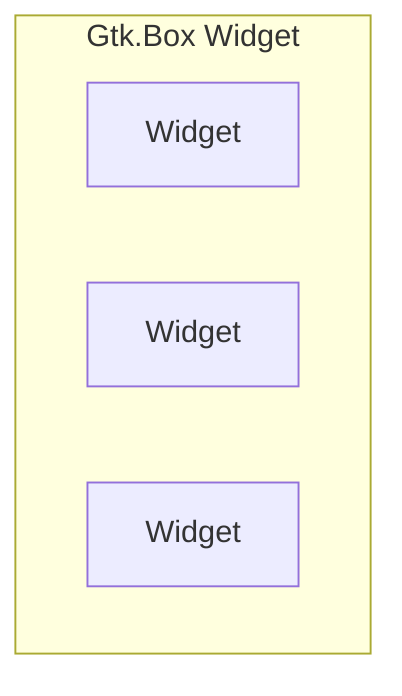
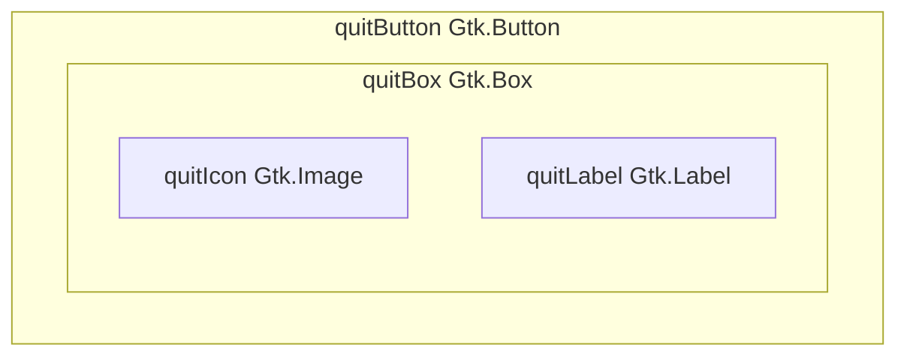
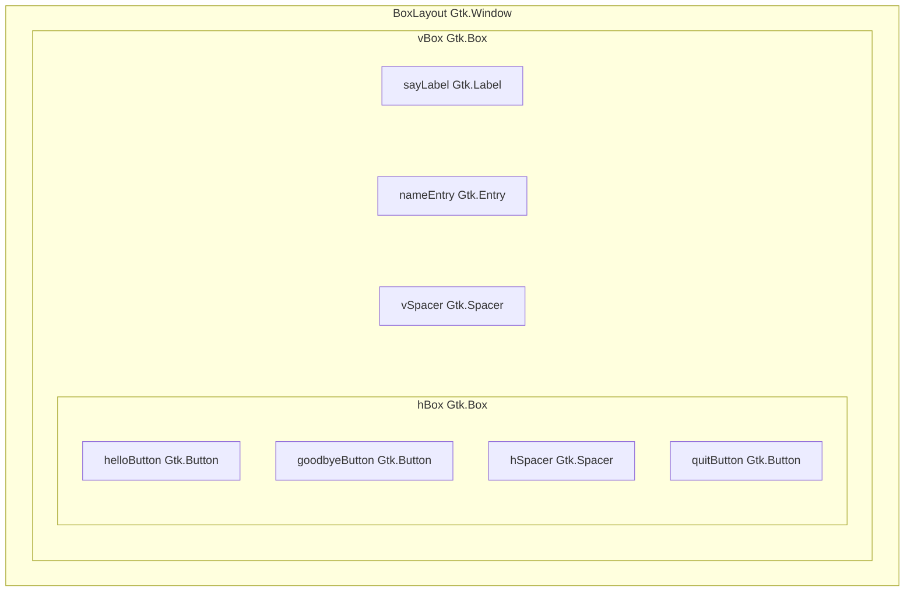
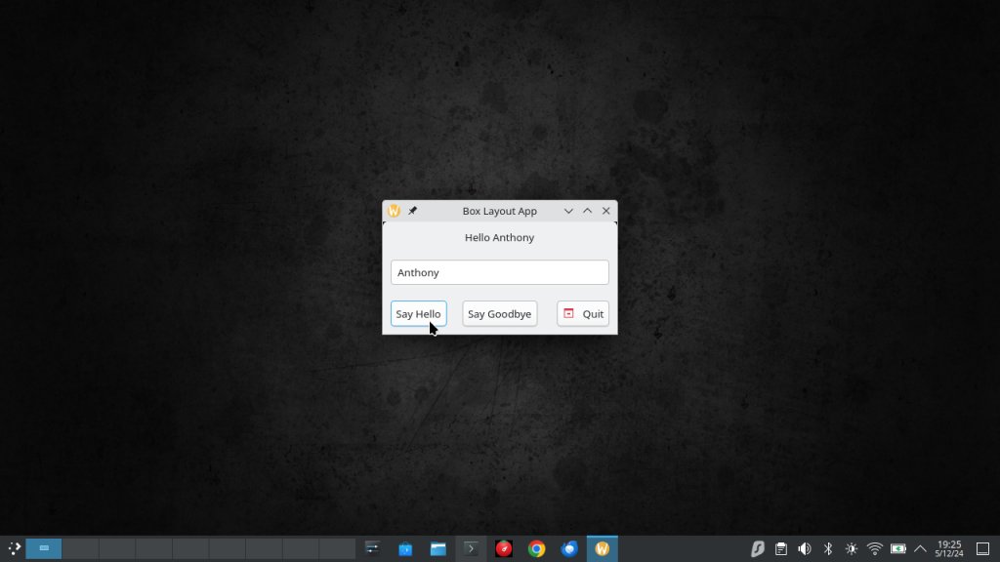
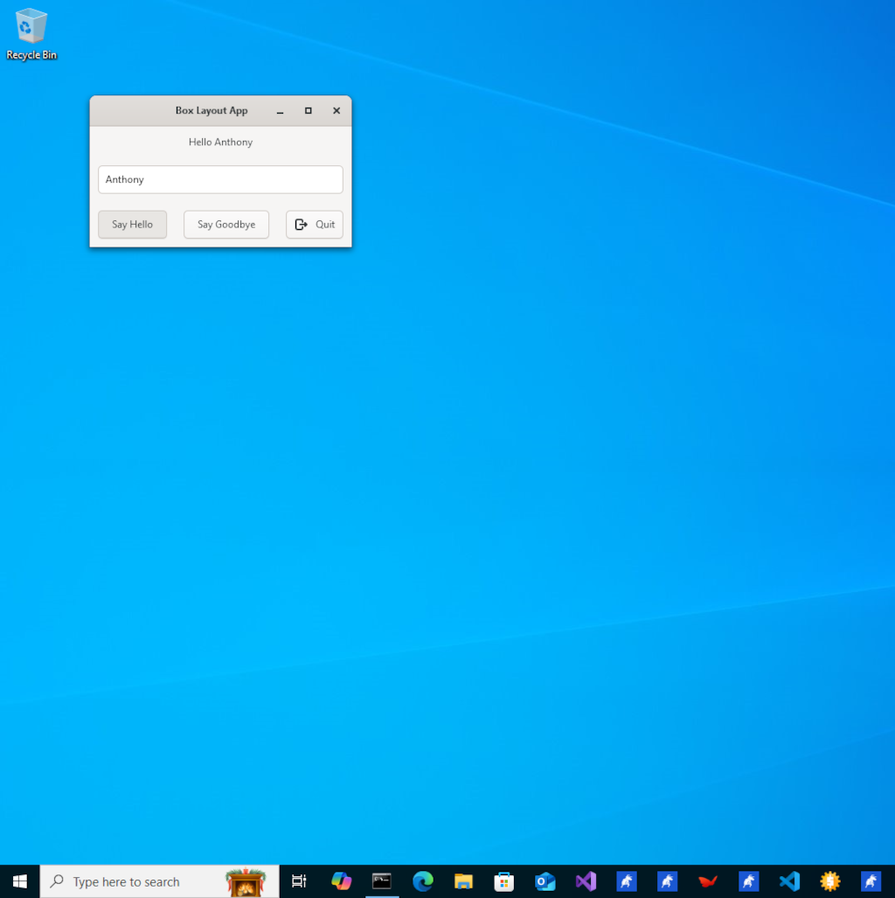
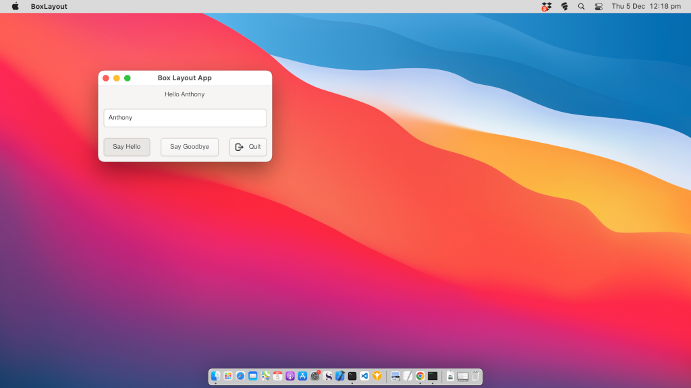

# Box Layout Gtk Tutorial

In this box layout tutorial, you will learn how to build a C# Gtk Application that makes use of the box layout to display multiple widgets both vertically and horizontally.

You will also learn how to use a box layout to display an icon and a label inside a Gtk.Button widget.

We will begin by going to the `GtkTutorials` directory in the terminal. This directory was created in the previous `Hello World` tutorial. If you have not done that tutorial then you can follow that tutorial to get the directory structure set up for following this tutorial series.

Now run the following commands.

```
dotnet new console -f net8.0 -o BoxLayout
dotnet sln add BoxLayout/
cd BoxLayout
dotnet add package GirCore.Gtk-4.0 --version 0.5.0
```

With these commands you created a new BoxLayout project, added it to the sln file for people who use IDEs and added the Gir.Gtk-4.0 package to the project.

> [!TIP]
> You can check for newer versions by visiting the nuget website at [https://www.nuget.org/packages/GirCore.Gtk-4.0/#versions-body-tab](https://www.nuget.org/packages/GirCore.Gtk-4.0/#versions-body-tab).

We will now create a new class file to make the BoxLayout window in Gtk. This will be loaded from the `Program.cs` file and will be the main window of the application.

```
dotnet new class -n BoxLayout
```

Now open the BoxLayout directory in your favourite code editor or ide so we can edit the project files.

> [!NOTE]
> The code is commented to tell you what is happening. In addition to these comments, the highlighted lines will be discussed further after the code block to give you more information.

**Filename: Program.cs**
[!code-csharp[](src/BoxLayout/Program.cs?highlight=7,18)]

You will notice that the `Program.cs` file is almost identical to the one in the previous `Hello World` tutorial. The `Program.cs` file is usually the same boilerplate code that loads the window to display and the only changes are on the highlighted lines 7 and 18.

**Line 7:**
[!code-csharp[](src/BoxLayout/Program.cs#L7)]

On line 7 we changed the application id which is the reverse dns domain `com.example.boxlayout` this will be unique for each application and should be a domain you own. If you do not own a domain then you can use a project specific domain like `io.github.projectname` that is unique to your project.

**Line 18:**
[!code-csharp[](src/BoxLayout/Program.cs#L18)]

On line 18 we changed the window class that is being used to display the window which in this case is `BoxLayout.BoxLayout` this is `namespace.class_name`. We are also passing in a `Gtk.Application` argument with the variable `application` which is the instance of `Gtk.Application` which is being used for this Gtk Application we are building.

By passing the `Gtk.Application` instance to the `BoxLayout` object we will have access to things in `Gtk.Application` from the window created by the `BoxLayout` class, this is useful for adding menus, quit buttons etc.

Now that the `Program.cs` file is setup we need to build the window for the application. We will do this by adding the following code to the `BoxLayout.cs` file.

> [!NOTE]
> The code is commented to tell you what is happening. In addition to these comments, the highlighted lines will be discussed further after the code block to give you more information.

**Filename: BoxLayout.cs**
[!code-csharp[](src/BoxLayout/BoxLayout.cs?highlight=11, 24, 39, 41, 44, 46-47, 50, 88-89, 98-99, 123)]

**Line 11:**
[!code-csharp[](src/BoxLayout/BoxLayout.cs#L11)]

On line 11 you will see that in the `BoxLayout` constructor we have a parameter for `Gtk.Application` and assign it the variable `app`. This will give us access to the running `Gtk.Application` and is useful for things like adding a quit button, adding menu item actions etc.


**Line 24:**
[!code-csharp[](src/BoxLayout/BoxLayout.cs#L24)]

On line 24 you will see that we are adding a `Gtk.Button` widget and using the `NewWithLabel()` method to create the `Gtk.Button` without having to use `goodbyeButton.SetLabel("Button Label");` or `goodbyeButton.Label = "Button Label";` after the button is declared.

**Line 39:**
[!code-csharp[](src/BoxLayout/BoxLayout.cs#L39)]

On line 39 we are adding a `Gtk.Box` which is used to display multiple widgets at the same time. In this instance, we are using it to show both an `Icon` and a `Label` inside the `Gtk.Button` widget that is being used as a quit button.

We are setting `Gtk.Orientation.Horizontal` which will make the widgets appear side by side with each new widget being added at the end.

The value `10` is the gap in pixels that is between each widget that is added to the `Gtk.Box`.

**Example of Gtk.Box with horizontal orientation and 3 widgets inside:**


**Example of Gtk.Box with vertical orientation and 3 widgets inside:**


**Line 41:**
[!code-csharp[](src/BoxLayout/BoxLayout.cs#L41)]

On line 41 we are creating a `Gtk.Label` to use as a label on our quit button. We are using the `NewWithMnemonic()` method to create a label that has the mnemonic `Alt+Q` which will act as the button being clicked when the user presses `Alt+Q`.

**Line 44:**
[!code-csharp[](src/BoxLayout/BoxLayout.cs#L44)]

On line 44 we are creating a `Gtk.Image` to use as an icon for our quit button. We are using the `NewFromIconName()` method to assign the icon `application-exit` when declaring the `quitIcon` variable. 

> [!NOTE]
> `application-exit` is an icon name that is part of the [Free Desktop Icon Theme Specification](https://specifications.freedesktop.org/icon-naming-spec/latest/) and is used by many desktop environments. If Gtk cannot find the icon name then it will show a broken image icon to indicate it could not find the icon.
>
> The `Icon Library` application can be used to browse and search icons. You can click icons to get additional information and it shows a sample of how to add the icon as a `gresource` to an application in multiple programming languages. The application can be downloaded from [FlatHub](https://flathub.org/apps/org.gnome.design.IconLibrary) or installed using your linux distributions package manager, usually, the package will be called `icon-library`.
> 
> Gtk Applications use the `Adwaita` icon theme by default. If you are not seeing the icons make sure that you have the theme installed. The theme package is usually called `adwaita-icon-theme` and can be installed using your package manager on Linux, [Home Brew](https://brew.sh/) on MacOS and [MSYS2](https://www.msys2.org/) on Windows.

**Lines 46 and 47:**
[!code-csharp[](src/BoxLayout/BoxLayout.cs#L46-L47)]

On lines 46 and 47, we are appending the `quitIcon` and `quitLabel` widgets to the `quitBox`. As this is a `Gtk.Box` with a `horizontal` orientation the widgets will be shown side by side.

**Line 50:**
[!code-csharp[](src/BoxLayout/BoxLayout.cs#L50)]

On line 50 we are setting the `quitButton` child to be the `quitBox` which will show the contents of the `quitBox Gtk.Box` inside the `quitButton Gtk.Button` widget.

**quitButton Gtk.Button child is now the quitBox Gtk.Box widget:**


> [!TIP]
> `Append` adds widgets to the end of the `Gtk.Box` and `Prepend` adds widgets to the start of the `Gtk.Box`. Try experimenting with the code by changing the code to be as shown below and notice how the order of the `quitIcon` and `quitLabel` change position.
>
> ```
> quitBox.Prepend(quitIcon);
> quitBox.Prepend(quitLabel);
> ```

**Lines 88 and 89:**
[!code-csharp[](src/BoxLayout/BoxLayout.cs#L88-L89)]
On line 88 we are making the `vSpacer` variable be an empty `Gtk.Box` widget with vertical orientation. This will be used to create blank space between the widgets at the top of the window and the widgets at the bottom of the window. We need to do this so that the widgets at the bottom of the window remain at the bottom when the window is resized.

On line 89 we use `SetVexpand(true)` to make the `vSpacer Gtk.Box` widget expand to take up all available space. By doing this the `vSpacer Gtk.Box` widget will push all widgets after it to the bottom of the window. 


**Lines 98 and 99:**
[!code-csharp[](src/BoxLayout/BoxLayout.cs#L98-L99)]
On line 98 we are making the `hSpacer` variable be an empty `Gtk.Box` widget with horizontal orientation. This will be used to create blank space between the widgets at the start (left) of the window and the widgets at the end (right) of the window. We need to do this so that the widgets at the end of the window remain at the end when the window is resized.

On line 99 we use `SetHexpand(true)` to make the `hSpacer Gtk.Box` widget expand to take up all available space. By doing this the `hSpacer Gtk.Box` widget will push all widgets after it to the end (right) of the window. 

**Line 123:**
[!code-csharp[](src/BoxLayout/BoxLayout.cs#L123)]

On line 123 you set the `Child` of the `BoxLayout Gtk.Window` widget to be the `vBox Gtk.Box` widget which makes the `BoxLayout Gtk.Window` have everything that is inside the `vBox Gtk.Box` widget.

**The BoxLayout Gtk.Window contents after making vBox the Child:**


**Run The BoxLayout Application:**

Now that you have entered the code needed for the application you can run the project.

```
dotnet run
```
If you have entered the code correctly and have the Gtk 4 runtime libraries installed correctly on your computer then you will see the Box Layout application window appear on the screen.

> [!TIP]
> Try resizing the window and see how the vSpacer and hSpacer widgets push the widgets to the bottom and right sides of the window.

Below are screenshots of the Box Layout application running on Linux, Windows and MacOS.

# [Linux](#tab/linux)


# [Windows](#tab/windows)


# [MacOS](#tab/mac)

