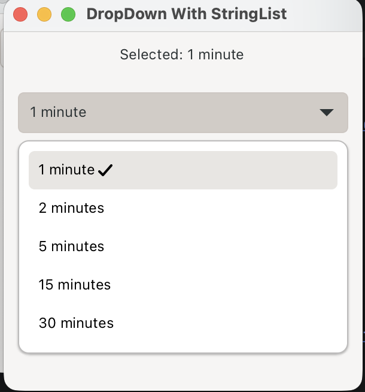
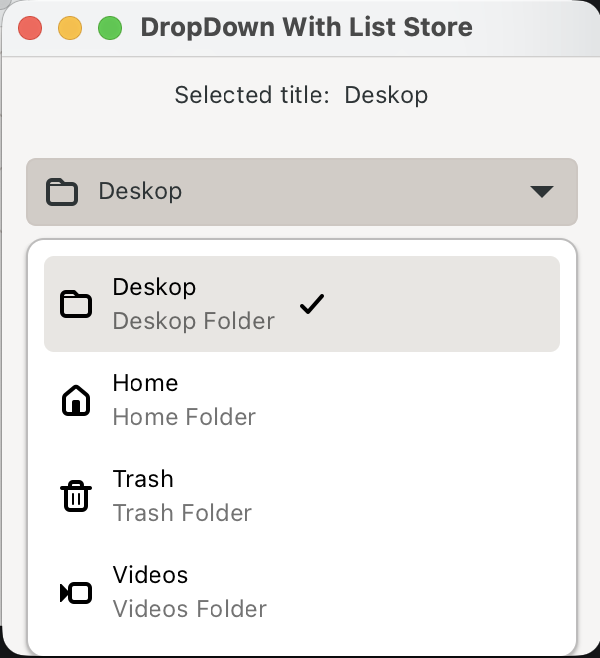

# GTK4 DropDown Sample

## Simple DropDown
Simple DropDown uses `Gtk.StringList` as model for DropDown.

<figure>
  
  <figcaption>Simple DropDown</figcaption>
</figure>

## Complex DropDown
Complex DropDown uses a custom model to hold the data that we want to display in the DropDown and uses `Gio.ListStore` with our custom model. Also 2 instances of `Gtk.SignalListItemFactory` are used to display items.

<figure>
  
  <figcaption>Complex DropDown</figcaption>
</figure>

## References
In no particular order
* [GTK DropDown](https://docs.gtk.org/gtk4/class.DropDown.html)
* [GTK4 DropDown Python Example](https://github.com/ksaadDE/GTK4PythonExamples/blob/main/DropDown.md)
* And many more
