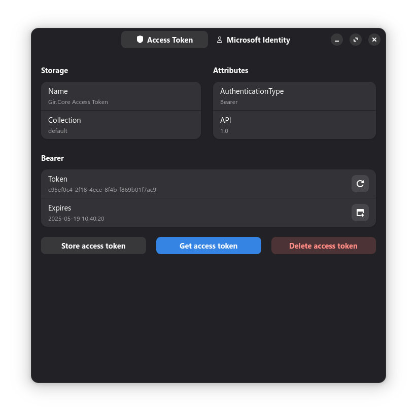
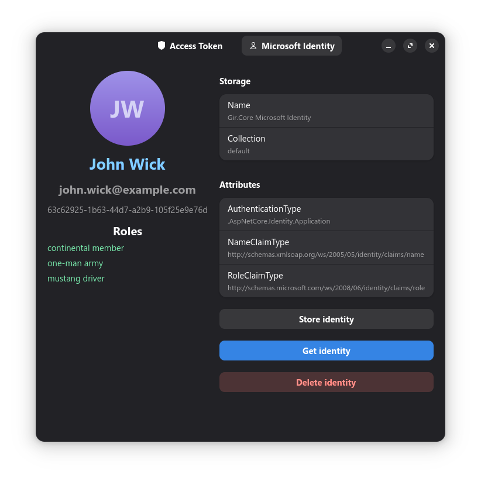

# Secret-1.gir demo – Gir.Core

This demo shows how to securely store access tokens and Microsoft Identity data using .NET and Gir.Core with libsecret.

The demo stores two secrets in the GNOME Keyring:

- **Gir.Core Access Token**
- **Gir.Core Microsoft Identity**

To inspect the stored data, it is recommended to install the GNOME Seahorse application.

The application runs on Linux only.

